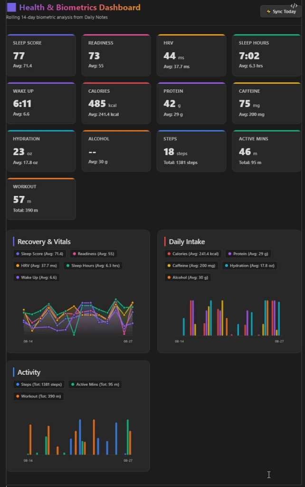

# Health Connect & Readiness Dashboard for Obsidian

A sleek, privacy-first Obsidian plugin that automatically syncs **Sleep, HRV, Readiness, Activity, Workout Durations, Hydration, and Nutrition** from **Google Health & Fitbit** directly into your Daily Note frontmatter and renders responsive ````health-dashboard```` visualizations.

[](https://github.com/TfTHacker/obsidian42-brat)
[](https://obsidian.md)
[](https://buymeacoffee.com/jare0014)

---



---

## ✨ Features

- **⚡ Automated Biometric Sync**: Pulls Sleep duration (`Sleep_hours`), Wakeup time (`wake_up`), RMSSD Heart Rate Variability (`HRV`), Steps (`steps`), Active Zone Minutes (`active_minutes`), Workouts (`workout`), and Nutrition (`caffeine`, `calories`, `protein`, `hydration`, `alcohol`) into Daily Notes with one click or automated background polling.
- **📊 Responsive Visual Dashboard**: Embed ````health-dashboard```` anywhere in your vault to get interactive KPI cards, rolling averages, total intake calculations, tooltips, and smooth zero-dependency SVG sparklines, multi-line trends, and grouped bar charts matching your Obsidian theme.
- **🏋️ Smart Workout Parsing**: Automatically parses exercise sessions (e.g. `Strength Training (8m), Strength Training (14m)`) into aggregated durations, chartable minutes, and detailed hover tooltips.
- **🥗 Food & Beverage Quick Logger**: Built-in visual logger with custom servings, presets, and local registry management that posts nutrition records directly to Google Health API and keeps your daily frontmatter synchronized.
- **🔘 Meta Bind Button Integration**: Register 1-click sync and modal buttons (`BUTTON[health-sync-today-btn]`, `BUTTON[health-food-logger-btn]`) directly in your Daily Note templates with one click.
- **🔒 100% Local & Private**: Direct secure OAuth 2.0 communication between Obsidian and Google Cloud APIs. Zero middleman servers, telemetry, or external subscriptions.
- **⚙️ Fully Configurable Field Mappings**: Map biometrics to any custom YAML frontmatter property names in your vault.

---

## 📦 Installation via BRAT (Beta Testing)

1. Install the **[BRAT (Obsidian42 - BRAT)](https://github.com/TfTHacker/obsidian42-brat)** plugin from Obsidian Community Plugins.
2. In Obsidian Settings, go to **BRAT > Add Beta plugin**.
3. Enter the repository URL:
   ```text
   https://github.com/jare0014/obsidian-health-connect
   ```
4. Click **Add Plugin**, then enable **Health Connect & Readiness Dashboard** under **Installed Plugins**.

---

## 🚀 Quick Setup Guide

Connecting your Google Account requires a free personal Google Cloud Project (takes ~3 minutes):

### Part 1: Create GCP Project & Enable Health API
1. Open the [Google Cloud Console](https://console.cloud.google.com/).
2. Click the project dropdown at top-left → **New Project** → Name it `Obsidian-Health` → Click **Create**.
3. Go to **APIs & Services > Library**, search for **Google Health API** (v4 REST API), and click **Enable**.

### Part 2: Configure OAuth Consent Screen & Scopes
1. Go to **APIs & Services > OAuth consent screen**.
2. Select **Audience / User Type: External** → Click **Create / Next**.
3. Enter an App Name (e.g. `Obsidian Health Connect`) and your email for Developer & Support contact.
4. Under **Scopes**, click **Add or Remove Scopes** and enable:
   - `https://www.googleapis.com/auth/googlehealth.sleep.readonly`
   - `https://www.googleapis.com/auth/googlehealth.health_metrics_and_measurements.readonly`
   - `https://www.googleapis.com/auth/googlehealth.activity_and_fitness.readonly`
   - `https://www.googleapis.com/auth/googlehealth.nutrition.readonly`
   - `https://www.googleapis.com/auth/googlehealth.nutrition.writeonly`
5. Under **Test users**, click **+ Add Users** and enter your personal Gmail address.  
   *(Tip: Click **Publish App** on the OAuth overview so your refresh token never expires after 7 days)*.

### Part 3: Create OAuth Client ID & Connect
1. Go to **APIs & Services > Credentials** → Click **+ Create Credentials > OAuth client ID**.
2. Application type: **Web application**.
3. Name: `Obsidian Client`.
4. Authorized redirect URIs: `http://localhost:8092`.
5. Click **Create** → Click **Download JSON** (or copy the Client ID and Client Secret).
6. Open **Obsidian Settings > Health Connect & Readiness**, paste the Client ID/Secret or the full downloaded JSON into the box, and click **Connect Google Account**.
7. Approve the permissions in your browser. The status badge will switch to `🟢 Connected`!

---

## 📊 Dashboard Usage

Add this codeblock anywhere in your Daily Notes, Weekly Reviews, or Health Dashboard note:

````markdown
```health-dashboard
```
````

### Custom Date Ranges & Options
You can override rolling windows or filter specific date ranges:

````markdown
```health-dashboard
days: 30
excludeWeekends: true
```
````

Or filter with exact start/end dates:

````markdown
```health-dashboard
from: 2026-08-01
to: 2026-08-19
```
````

---

## 🥗 Food & Beverage Logger

- Open the Quick Food Logger via ribbon icon 🍎 or command palette: `Health Connect: Quick Log Food / Beverage`.
- Select an item (e.g. *Americano*, *Espresso*, *Water*, *Protein Shake*) and adjust quantity.
- Clicking **Log to Google Health** writes the entry directly to Google Health v4 API and updates your active daily note frontmatter in real time.
- Manage custom items, calories, protein, caffeine, and volume presets in the **Manage Registry** tab.

---

## 🍏 Apple Health & iOS Shortcuts Ingestion

If you track your health, nutrition, or workouts on an **iPhone or Apple Watch**, you can automatically sync your daily Apple Health data into Obsidian via **Apple Shortcuts** and cloud sync (iCloud Drive, Obsidian Sync, Google Drive, or OneDrive):

1. In plugin settings, turn on **Enable Apple Health Ingestion**.
2. Specify your drop folder (e.g. `00_Imports/Health`).
3. In the iOS **Shortcuts app** on your iPhone:
   - Create a Shortcut querying daily samples: *Dietary Protein, Dietary Energy, Steps, Sleep Analysis, HRV, Water*.
   - Combine them into a JSON dictionary:
     ```json
     {
       "date": "2026-08-23",
       "protein": 140,
       "calories": 2200,
       "steps": 10500,
       "hydration": 80,
       "Sleep_hours": 7.8,
       "HRV": 65
     }
     ```
   - Save the file as `Health_YYYY-MM-DD.json` into your synced drop folder.
   - Set an iOS Automation to run nightly at 11:59 PM.
4. When Obsidian opens or syncs the file, the plugin automatically parses the metrics, updates today's Daily Note frontmatter, and safely archives the processed JSON file!

---

## ☕ Support the Project

If this plugin helps you maintain healthy habits and quantified-self insights, consider supporting future development:

[](https://buymeacoffee.com/jare0014)

---

## 📄 License

MIT License © 2026 Alex Jarecki
