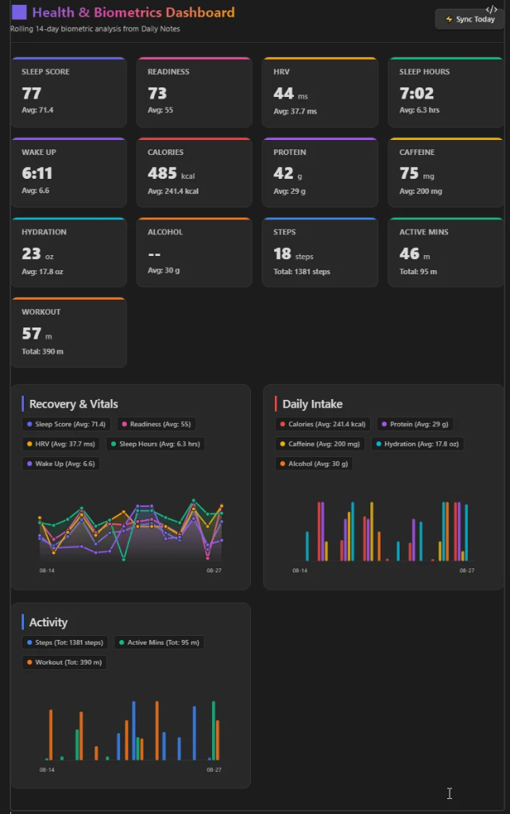

# Health Connect & Biometrics Dashboard for Obsidian

A sleek, privacy-first Obsidian plugin that automatically syncs and visualizes **Sleep, HRV, Readiness, Workouts, Hydration, and Nutrition** from **Google Health, Fitbit, Apple Health, or manually logged daily notes** directly into responsive ````health-dashboard```` charts and KPI cards.

[](https://github.com/TfTHacker/obsidian42-brat)
[](https://obsidian.md)
[](https://buymeacoffee.com/jare0014)

---



---

## ✨ Features

- **⚡ Automated & Manual Tracking**: Sync biometrics automatically from Google Health, Fitbit, and Apple Health, or chart your own manually tracked habits, mood, and health scores in Daily Notes.
- **📊 Responsive Visual Dashboard**: Embed ````health-dashboard```` anywhere in your vault to render interactive KPI cards, rolling averages, total intake calculations, tooltips, and smooth zero-dependency SVG sparklines, multi-line trends, and grouped bar charts matching your theme.
- **📝 Supported Data Formats**: The dashboard parses data from **YAML frontmatter (`Key: Value`)**, **inline Dataview fields (`Key:: Value`, `- [ ] Key:: Value`)**, and **bullet lists (`- Key: Value`)**.
- **🧮 Custom Calculated Metrics**: Define new metrics using spreadsheet-style mathematical formulas combining existing variables (e.g. `(protein * 4) + (carbs * 4) + (fat * 9)` or `(HRV / 60) * (Sleep_hours / 8) * 100`) with an optional toggle to write results back to your daily note frontmatter.
- **🏋️ Bidirectional Workout Sync & Reconciliation**: Cross-references workout sessions in Obsidian Daily Notes with Google Health API, uploading unrecorded local workouts and merging watch workouts without duplicate entries.
- **🥗 Food & Beverage Quick Logger**: Built-in visual logger with custom servings, presets, and local registry management that posts nutrition records directly to Google Health API and keeps your daily frontmatter synchronized.
- **🔒 100% Local & Private**: Direct secure OAuth 2.0 communication between Obsidian and Google Cloud APIs / local Apple Health drops. Zero middleman servers, telemetry, or external subscriptions.
- **🗺️ Fully Configurable Field Mappings**: Map incoming biometrics to any custom YAML frontmatter or inline property names in your vault.

---

## 🔄 How Syncing Works

This plugin supports flexible syncing pipelines for both **Android/Fitbit** and **Apple Watch/iPhone** ecosystems:

### 1. 🌐 Universal Cloud Sync (Google Health, Health Connect, Fitbit & Apple Watch) — *Recommended*
* **How it works**: Connects directly to the Google Health v4 REST API (`health.googleapis.com`) using your own free, personal Google OAuth 2.0 client.
* **📱 Android, Wear OS & Garmin**: Native sync with Pixel Watch, Samsung Galaxy Watch, Fitbit, Garmin (via Garmin Connect → Health Connect), and any wearable connected to Android **Health Connect** / **Google Health**.
* **🍏 iPhone & Apple Watch**: Simply install the free **Google Health / Google Fit** app on your iPhone and allow it to sync with Apple Health. All your Apple Watch sleep, heart rate, workouts, and steps automatically sync to your Google Health cloud backend and flow straight into Obsidian!
* **What it syncs**:
  * **Sleep & Recovery**: Sleep duration (`Sleep_hours`), Sleep Score (`Sleep_score`), Deep Sleep (`deep_sleep_hours`), Sleep Stages (*Deep, REM, Light, Awake*), Wake-up time (`wake_up`), Bedtime.
  * **Vitals & HRV**: RMSSD Heart Rate Variability (`HRV`), Resting Heart Rate (`resting_heart_rate`), Blood Oxygen (`spo2`), Respiratory Rate (`respiratory_rate`), Skin Temperature.
  * **Activity & Fitness**: Steps (`steps`), Active Zone Minutes (`active_minutes`), Calories Burned (`calories_burned`), Distance, Floors Climbed, and Workouts (`workout`).
  * **Body Measurements**: Weight (`weight`), Body Fat % (`body_fat`), BMI.
  * **Nutrition & Hydration**: Calories (`calories`), Protein (`protein`), Carbs (`carbs`), Fat (`fat`), Hydration (`hydration`), Caffeine (`caffeine`).
* **Bi-directional Workouts & Nutrition**: Built-in visual loggers write workouts and meal entries directly to Google Health API and update your active daily note frontmatter in real time.
* **🧘 Local-First Mindfulness**: Mindfulness minutes (`mindfulness_minutes`) are logged directly to your daily notes via the Health Activity Hub or extracted automatically from Schedule Assistant / Focus timer logs, keeping your personal reflection journal local and private.

### 2. 📂 Watched Folder JSON Ingestion (Apple Health, Garmin & Offline Drops) — *Optional Offline Path*
* **How it works**: For privacy-focused users or offline automation who prefer a 100% local workflow without a Google account. Point the plugin to any vault folder (e.g. `00_Imports/Health/`) to watch for exported health JSON files.
* **Hands-Free Ingestion**: A real-time vault watcher automatically detects incoming JSON files, parses the metrics into your Daily Notes, and safely archives the processed files into an `Archive/` subfolder.

---

## 📦 Installation via BRAT (Beta Testing)

1. Install the **[BRAT (Obsidian42 - BRAT)](https://github.com/TfTHacker/obsidian42-brat)** plugin from Obsidian Community Plugins.
2. In Obsidian Settings, go to **BRAT > Add Beta plugin**.
3. Enter the repository URL:
   ```text
   https://github.com/jare0014/obsidian-health-connect
   ```
4. Click **Add Plugin**, then enable **Health Connect & Biometrics Dashboard** under **Installed Plugins**.

---

## 🚀 Quick Setup Guide

Connecting your Google Account requires a free personal Google Cloud Project (takes ~3 minutes):

### Part 1: Create GCP Project & Enable Health API
1. Open the [Google Cloud Console](https://console.cloud.google.com/).
2. Click the project dropdown at top-left → **New Project** → Name it `Obsidian-Health` → Click **Create**.
3. Go to **APIs & Services > Library**, search for **Google Health API** (v4 REST API), and click **Enable**.

### Part 2: Configure OAuth Consent Screen & Scopes
1. Go to **APIs & Services > OAuth consent screen**.
2. Select **Audience / User Type: External** → Click **Create / Next**.
3. Enter an App Name (e.g. `Obsidian Health Connect`) and your email for Developer & Support contact.
4. Under **Scopes**, click **Add or Remove Scopes** and enable:
   - `https://www.googleapis.com/auth/googlehealth.sleep.readonly`
   - `https://www.googleapis.com/auth/googlehealth.health_metrics_and_measurements.readonly`
   - `https://www.googleapis.com/auth/googlehealth.activity_and_fitness.readonly`
   - `https://www.googleapis.com/auth/googlehealth.activity_and_fitness.writeonly`
   - `https://www.googleapis.com/auth/googlehealth.nutrition.readonly`
   - `https://www.googleapis.com/auth/googlehealth.nutrition.writeonly`
5. Under **Test users**, click **+ Add Users** and enter your personal Gmail address.  
   *(Tip: Click **Publish App** on the OAuth overview so your refresh token never expires after 7 days)*.

### Part 3: Create OAuth Client ID & Connect
1. Go to **APIs & Services > Credentials** → Click **+ Create Credentials > OAuth client ID**.
2. Application type: **Web application**.
3. Name: `Obsidian Client`.
4. Authorized redirect URIs: `http://localhost:8092`.
5. Click **Create** → Click **Download JSON** (or copy the Client ID and Client Secret).
6. Open **Obsidian Settings > Health Connect & Biometrics Dashboard**, paste the Client ID/Secret or the full downloaded JSON into the box, and click **Connect Google Account**.
7. Approve the permissions in your browser. The status badge will switch to `🟢 Connected`!

---

## 📊 Dashboard Usage

Add this codeblock anywhere in your Daily Notes, Weekly Reviews, or Health Dashboard note:

````markdown
```health-dashboard
```
````

### Custom Date Ranges & Options
You can override rolling windows or filter specific date ranges:

````markdown
```health-dashboard
days: 30
excludeWeekends: true
```
````

Or filter with exact start/end dates:

````markdown
```health-dashboard
from: 2026-08-01
to: 2026-08-19
```
````

---

## 🏥 Health Activity & Registry Hub

- **Quick Modal Access**: Open via ribbon icon 💓 or command palette: `Health Connect: Open Health Activity Hub`.
- **Three Unified Verbs**:
  - **Add to Log 📝**: Quickly log Food/Drinks, Workouts, Mindfulness sessions, or Sleep stats.
  - **View History 🕒**: Inspect recent Google Health records (food, workouts) and local Daily Note records (mindfulness, sleep) with 1-click **"Pull to Note 📥"** buttons.
  - **Manage Registry ⚙️**: Manage custom food items, workout presets with Google Health API activity type mappings, and mindfulness session presets.
- **Instant Shortcuts**: Direct commands exist for power users who want to jump straight to a specific log (`Quick Log Food & Drink`, `Quick Log Workout`, `Quick Log Mindfulness`, `Quick Log Sleep`).
- **Cloud & Local Persistence**: Posts workouts and nutrition events directly to Google Health v4 REST API, while persisting mindfulness and sleep directly to Daily Note frontmatter.

---

## 🧮 Custom Calculated Metrics (Formula Builder)

Want to create composite health scores or compute macro calories from separate fields? Use the built-in **Formula Builder** in settings:

- **Spreadsheet-Style Math**: Write standard arithmetic formulas (e.g., `(protein * 4) + (carbs * 4) + (fat * 9)` or `(HRV / 60) * (Sleep_hours / 8) * 100`).
- **Clickable Variable Chips**: Quick-insert detected variables into your formula.
- **Frontmatter Writeback**:
  - *Display Only*: Calculated on the fly when rendering the ````health-dashboard```` codeblock.
  - *Write to Note*: Automatically saved into your daily note frontmatter during sync!

---

## 📂 Watched Folder JSON Ingestion (Apple Health, Garmin & Offline Automation)

If you prefer an offline workflow or automated file drops, the plugin can monitor a target folder in your vault (e.g. `00_Imports/Health/`) and automatically ingest any structured health JSON files into your daily notes:

1. In plugin settings, turn on **Watched Folder Ingestion** (or **Enable Apple Health Ingestion**).
2. Specify your drop folder (e.g. `00_Imports/Health`).
3. Whenever an automated script or shortcut drops a `*.json` file into this folder, the plugin parses the metrics, updates that date's Daily Note frontmatter, and moves the processed file to an `Archive/` subfolder.

<details>
<summary>📱 <b>iOS Shortcut Setup Example (Apple Health)</b></summary>

For Apple Watch and iPhone users who prefer offline file export instead of Google Health cloud sync:
1. In the iOS **Shortcuts app** on your iPhone:
   - Create a Shortcut querying daily samples: *Dietary Protein, Dietary Energy, Steps, Sleep Analysis, HRV, Water*.
   - Combine them into a JSON dictionary:
     ```json
     {
       "date": "2026-08-23",
       "protein": 140,
       "calories": 2200,
       "steps": 10500,
       "hydration": 80,
       "Sleep_hours": 7.8,
       "HRV": 65
     }
     ```
   - Save the file as `Health_YYYY-MM-DD.json` into your synced drop folder (via iCloud Drive, Obsidian Sync, or cloud drive).
   - Set an iOS Automation to run nightly at 11:59 PM.
2. Obsidian will automatically ingest the file on sync and archive it!
</details>

<details>
<summary>🏃 <b>Garmin & Other Wearables</b></summary>

* **Cloud (Recommended)**: Link **Garmin Connect** to **Android Health Connect** in the Garmin Connect mobile app settings. Your Garmin steps, heart rate, sleep, and workouts will flow into Google Health and sync directly to Obsidian with zero manual file exports.
* **Watched Folder**: If using third-party export scripts (e.g., Python scripts or Garmin DB exporters), have them output a JSON file with `date` and biometric key/value pairs to your watched folder.
</details>

---

## ⌨️ Command Palette Actions

Open the Obsidian Command Palette (`Ctrl/Cmd + P`) to trigger any of the following actions:

| Command | Description |
| :--- | :--- |
| **`Health Connect: Open Health Activity Hub`** | Opens the unified modal with tabs for Add to Log, View History, and Manage Registry across Nutrition, Workouts, Mindfulness, and Sleep. |
| **`Health Connect: Quick Log Food / Beverage`** | Opens the hub directly into the Nutrition logging tab. |
| **`Health Connect: Quick Log Workout / Exercise`** | Opens the hub directly into the Workout logging tab to post to Google Health and note frontmatter. |
| **`Health Connect: Quick Log Mindfulness / Meditation`** | Opens the hub directly into the Mindfulness logging tab to log to daily note frontmatter. |
| **`Health Connect: Quick Log Sleep Stats`** | Opens the hub directly into the Sleep logging tab to log to daily note frontmatter. |
| **`Health Connect: Sync Today's Google Health Biometrics`** | Immediately syncs today's sleep, HRV, steps, and biometrics into today's daily note. |
| **`Health Connect: Reconcile Workouts with Google Health (Bidirectional)`** | Reconciles daily note frontmatter workouts with Google Health API, uploading unrecorded sessions and merging cloud workouts. |
| **`Health Connect: Backfill & Sync Last 14 Days Biometrics`** | Queries the past 14 days from Google Health API and backfills missing historical daily notes. |
| **`Health Connect: Scan & Ingest Apple Health Drop Folder (JSON)`** | Manually scans your configured drop folder for any pending health JSON drops. |

---

## ☕ Support the Project

If this plugin helps you maintain healthy habits and quantified-self insights, consider supporting future development:

[](https://buymeacoffee.com/jare0014)

---

## 📄 License

MIT License © 2026 Alex Jarecki
